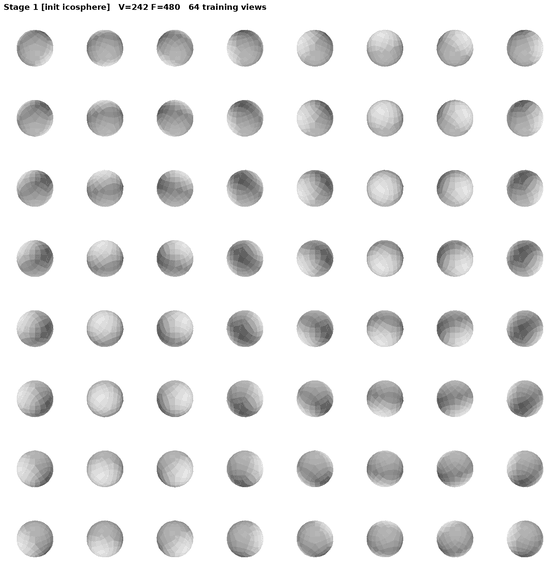
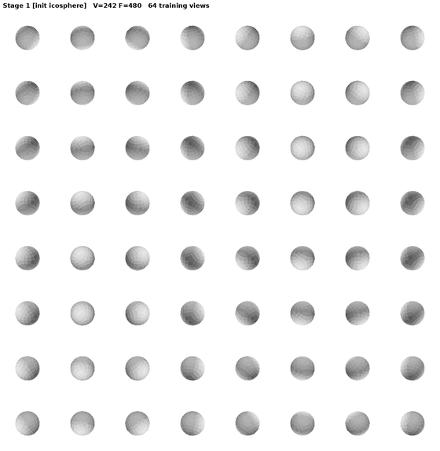
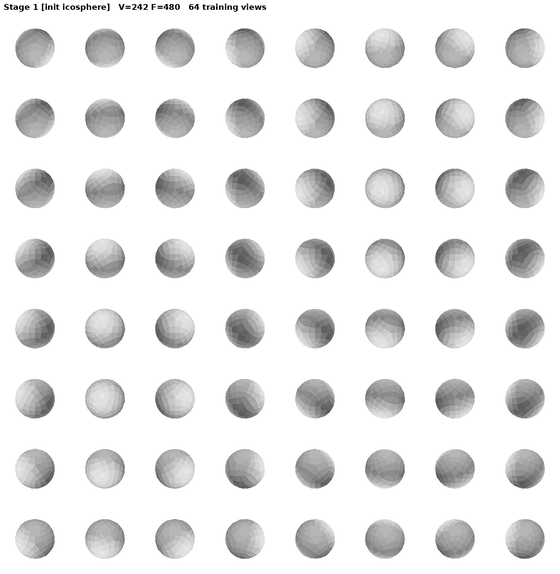
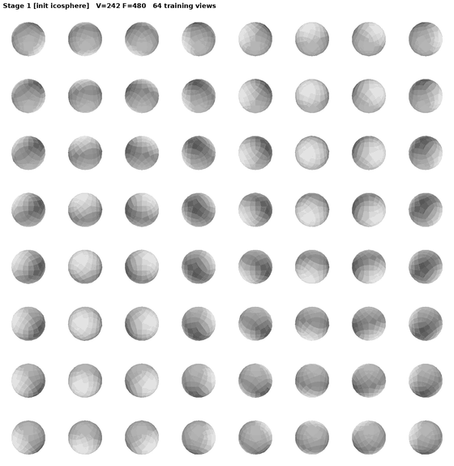

# Topo-Carving

**Discovering surface topology from multi-view silhouettes — with guaranteed-manifold operators.**

Most differentiable mesh reconstruction assumes the topology (a template with the right number of
holes) and only preserves it. **Topo-Carving discovers the genus from the images**: a space-carving
oracle tells the optimizer *how many* tunnels the shape has and *where* they are, and every topology
change is executed as a TopMod **DLFL `add_handle`** — so the mesh is a valid orientable 2-manifold,
watertight, after **every** step, and the genus can never drift silently.

<p align="center">
 4"/>
<br/><i>Fertility: starting from a genus-0 sphere, the pipeline discovers and opens all 4 tunnels —
each one a DR-verified DLFL add_handle.</i>
</p>

## Highlights (golden v6.3)

- **Correct genus on 5/5 benchmark shapes** (armadillo 0, kitten 1, rockerarm 1, threeholes 3,
  fertility 4) — 15/15 chains in a ×3 regression, robust to CUDA nondeterminism.
- **Count-first propose-and-verify**: a handle is accepted on render evidence *or* when the oracle
  says a tunnel is missing and the membrane is genuine air / hull-located — fixing the classic
  failure where a real thin tunnel opens with a *negative* render gain and gets rejected.
- **Hull-guided completion**: when the refined mesh sits flush to the hull and image-space detection
  stalls, the hull's own tunnel location proposes the handle.
- Held-out silhouette IoU **0.9972** on armadillo (DMesh plateaus at 0.989), volume IoU **0.9915**
  on fertility with the seam-free finish.

## Algorithm in one figure

<p align="center">

</p>

1. **Carve the oracle.** A voting visual hull is carved from the input silhouettes once. Its Euler
   number gives the tunnel **count** g\* (morphological closing ladder, mode over radii); a
   closing-ladder plug analysis gives each tunnel's **location** on demand.
2. **Discover topology by propose-and-verify.** Outside-hull membranes propose handle sites; a
   deterministic count-first gate accepts/rejects; the handle is executed as DLFL `add_handle` and
   verified by differentiable rendering. The loop stops exactly at g\*.
3. **Complete from the hull when detection stalls.** Late in refinement the mesh hugs the hull and
   membranes vanish — the oracle's plug locations take over (`prov=hull` → unconditional accept).
4. **Refine with guaranteed-manifold operators only.** Link-condition-guarded collapses,
   Euler-preserving flips/subdivision, position-only DR: topological robustness holds **by
   construction**, not by a regularizer.

## Results

| | | |
|:--:|:--:|:--:|
|  |  |  |
| armadillo — discovered genus **0** | kitten — discovered genus **1** | rockerarm — discovered genus **1** |

<p align="center">

<br/><i>The oracle knows <b>where</b>: hull tunnel plugs on a genus-3 intermediate mesh — the yellow
plug is the missing 4th tunnel, located even though the mesh sits flush to the hull.</i>
</p>

## Comparison with prior work

| Method | topology source | discovers genus? | manifold guarantee | genus drift possible? |
|---|---|---|---|---|
| Nicolet et al. (Large Steps) | fixed input mesh | no | no | yes (handle collapse) |
| Gu et al. (ICASSP 2026) | template (count + rough location) | no | no | patched via PH prior |
| DMesh | implicit (existence probs) | partially | no (self-prunes) | yes |
| Palfinger | fixed | no | remesh-based | yes |
| **Topo-Carving (ours)** | **discovered from the carved hull** | **yes** | **by construction (DLFL)** | **impossible by construction** |

<p align="center">


</p>

Every component earns its place (fertility, GT genus 4, n=15 per config): removing the oracle
collapses genus accuracy to **4/15** and fails in *both* directions (missed **and** spurious
tunnels); the count-first gate and hull-guided completion each close the remaining 13/15 → 15/15
gap from different sides (decision vs detection). Full study:
[`GATE_DECISION_findings.md`](experiments/opseq_v5/despike/GATE_DECISION_findings.md) — including
the honest negative result that a typed-decision language model is a coin flip at the decisive
geometric decision.

## Reproduce

```bash
cd experiments/opseq_v5
SHAPES="fertility threeholes kitten rockerarm armadillo" TAGP=repro \
USE_JEV=1 GATE_BACKEND=count HULL_COMPLETE=1 bash despike/golden_chain.sh
# prints [RESULT] <shape>: final genus G (GT g) OK per shape
```

Requires: PyTorch (cu-enabled), nvdiffrast, open3d, scipy/scikit-image. Tested on RTX 5090
(torch 2.14 + cu130, sm_120).

| tag | what |
|---|---|
| `golden-v6.1` | baseline chain (fertility 13/15) |
| `golden-v6.2` | count-first gate + hull-guided completion + plug-cache fix (15/15) |
| `golden-v6.3` | + late-handle seam refit (Stage 6b), seam artifact eliminated |

## Documentation

- [`PAPER_NOTES.md`](experiments/opseq_v5/despike/PAPER_NOTES.md) — paper skeleton: contributions,
  ablation table, negative results, limitations
- [`results64v/GOLDEN.md`](experiments/opseq_v5/despike/results64v/GOLDEN.md) — version log with all
  measured numbers (incl. the fair face-count comparison vs DMesh)
- [`SELLING_POINT_topology_robustness.md`](experiments/opseq_v5/despike/SELLING_POINT_topology_robustness.md)
  — why genus drift is impossible by construction
- [`real/CAPTURE_SPEC.md`](experiments/opseq_v5/real/CAPTURE_SPEC.md) — iPhone capture protocol for
  real-data topology discovery (ARKit poses + SAM2 masks, tooling included)

## The TopMod library underneath

The topology machinery is a pure-Python implementation of Dr. Ergun Akleman's **TopMod** DLFL mesh
system: **29 operators** (4 fundamental + 6 high-level + 7 classic subdivision + 12 remeshing
schemes) with closed-form oracle tests, **100% differentiable** position maps (PyTorch), a
**Blender addon** (21 operators in Edit Mode), and an autoregressive mesh tokenizer. Zero required
dependencies for the core.

→ Full library documentation, quick start, Blender install guide and the operator reference:
**[`LIBRARY.md`](LIBRARY.md)** · [`docs/operators.md`](docs/operators.md)

## Citation

Paper in preparation. For now:

```bibtex
@misc{topocarving2026,
  title  = {Topo-Carving: Discovering Surface Topology from Multi-View Silhouettes
            with Guaranteed-Manifold Operators},
  author = {GenesisTopmod team},
  year   = {2026},
  url    = {https://github.com/frankwings/GenesisTopmod}
}
```

Built on Dr. Ergun Akleman's TopMod topological mesh modeling theory.
