# TopMod Operator Reference

> Generated by `scripts/generate_op_gallery.py` — manual edits will be
> overwritten. Edit the registry in that script and re-run it.

Complete reference for every mesh operator in GenesisTopmod: signature,
parameters, closed-form oracle (element-count effect), tokenizer opcode, and
a before/after visualization. Every operator preserves 2-manifoldness at
every step (the constructive DLFL guarantee of Akleman & Chen 2003).

- The **oracle** column gives the exact closed-form effect on (V, E, F); it
  is what `tests/test_semantic_oracle.py` asserts. All operators preserve χ
  and genus except `add_handle` and crust hole punching.
- The **token** column is the opcode in the `topmod/tokenizer.py` vocabulary;
  tokenized operators can be serialized to integer-ID sequences and replayed
  by `detokenize` (the basis for autoregressive mesh generation).
- All images are rendered by this script; both sides are annotated with
  V/E/F counts.
- The **Diff** column reports PyTorch differentiability of the operator's
  *position map* (output vertex coordinates as a function of input
  coordinates, with the operator sequence held fixed) via
  `topmod/diffgeo.py`. Topology itself is always discrete and carries no
  gradient. ✅ = all 29 operators are now differentiable (17 linear via
  sparse-matrix trace + 7 dedicated torch implementations + 3
  identity-geometry + 1 free-parameter + 1 no-geometry). See
  `docs/diffgeo.md` for the API.

## Quick Reference

| # | Operator | Token | Oracle (V', E', F') | Diff | Image |
|---|---|---|---|---|---|
| #1 | [`create_vertex`](#1-create_vertex) | CV | V+1, E+0, F+1 (point sphere) | ✅ Yes | — |
| #2 | [`delete_vertex`](#2-delete_vertex) | — | V−1, E+0, F−1 | — | — |
| #3 | [`insert_edge`](#3-insert_edge) | IE | E+1; same face → F+1 (split), different faces → F−1 (merge components / open handle) | ✅ Yes | [img](assets/ops/insert_edge.png) |
| #4 | [`insert_edge_cross`](#4-insert_edge_cross) | IE | E+1, F−1 (two faces merge into one) | ✅ Yes | [img](assets/ops/insert_edge_cross.png) |
| #5 | [`delete_edge`](#5-delete_edge) | DE | E−1; two distinct sides → F−1 (merge), same face both sides → F+1 | ✅ Yes | [img](assets/ops/delete_edge.png) |
| #6 | [`extrude_face`](#6-extrude_face) | — | V+n, E+2n, F+n (n = face degree) | ✅ Yes | [img](assets/ops/extrude_face.png) |
| #7 | [`stellate`](#7-stellate) | — | V+1, E+n, F+n−1 | ✅ Yes | [img](assets/ops/stellate.png) |
| #8 | [`subdivide_edge`](#8-subdivide_edge) | — | V+1, E+1, F+0 | ✅ Yes | [img](assets/ops/subdivide_edge.png) |
| #9 | [`subdivide_face`](#9-subdivide_face) | — | V+1, E+n, F+n−1 | ✅ Yes | [img](assets/ops/subdivide_face.png) |
| #10 | [`add_handle`](#10-add_handle) | HDL | V+0, E+n, F+n−2, χ−2, genus+1 (same component) | ✅ Yes | [img](assets/ops/add_handle.png) |
| #11 | [`stellate_all`](#11-stellate_all) | STA | V'=V+F, E'=3E, F'=2E | ✅ Yes | [img](assets/ops/stellate_all.png) |
| #12 | [`collapse_edge`](#12-collapse_edge) | — | V−1, E−(d0+d1−3), F−2 (d0,d1 = degrees of flanking faces) | ❌ Not yet | [img](assets/ops/collapse_edge.png) |
| #13 | [`trisect_edge`](#13-trisect_edge) | — | V+2, E+2, F+0 | ❌ Not yet | [img](assets/ops/trisect_edge.png) |
| #14 | [`subdivide_all_edges`](#14-subdivide_all_edges) | SAE | V'=V+E, E'=2E, F unchanged (for n_divs=2) | ✅ Yes | [img](assets/ops/subdivide_all_edges.png) |
| #15 | [`subdivide_all_faces`](#15-subdivide_all_faces) | — | V'=V+F, E'=3E, F'=2E | ✅ Yes | [img](assets/ops/subdivide_all_faces.png) |
| #16 | [`triangulate_face`](#16-triangulate_face) | — | V+0, E+(n−3), F+(n−3) for an n-gon | ✅ Yes | [img](assets/ops/triangulate_face.png) |
| #17 | [`triangulate_all`](#17-triangulate_all) | TRI | V+0, E+Σ(d_i−3), F+Σ(d_i−3) | ✅ Yes | [img](assets/ops/triangulate_all.png) |
| #18 | [`double_stellate_face`](#18-double_stellate_face) | — | V+(1+n), E+(n+3n), F+(n−1+3n−n) (complex) | ✅ Yes | [img](assets/ops/double_stellate_face.png) |
| #19 | [`stellate_subdivide`](#19-stellate_subdivide) | STSUB | V'=V+F, E'=2·Σd_i, F'=Σd_i (varies) | ✅ Yes | [img](assets/ops/stellate_subdivide.png) |
| #20 | [`punch_hole`](#20-punch_hole) | — | same as add_handle | ✅ Yes | [img](assets/ops/punch_hole.png) |
| #21 | [`extrude_face_dome`](#21-extrude_face_dome) | — | V+~5n, E+~10n, F+~5n (n = face degree, 5 extrusion rounds) | ✅ Yes | [img](assets/ops/extrude_face_dome.png) |
| #22 | [`make_wireframe`](#22-make_wireframe) | — | complex (MCC → crust → punch holes) | ❌ Not yet | [img](assets/ops/make_wireframe.png) |
| #23 | [`catmull_clark`](#23-catmull_clark) | CC | V'=V+E+F, E'=4E, F'=2E (all quads) | ✅ Yes | [img](assets/ops/catmull_clark.png) |
| #24 | [`dual`](#24-dual) | DUAL | V'=F, E'=E, F'=V | ✅ Yes | [img](assets/ops/dual.png) |
| #25 | [`doo_sabin`](#25-doo_sabin) | DS | V'=2E, E'=4E, F'=V+E+F | ✅ Yes | [img](assets/ops/doo_sabin.png) |
| #26 | [`simplest_subdivide`](#26-simplest_subdivide) | SIMP | V'=E, E'=2E, F'=F+V | ✅ Yes | [img](assets/ops/simplest_subdivide.png) |
| #27 | [`vertex_cutting`](#27-vertex_cutting) | VC | V'=2E, E'=3E, F'=F+V | ✅ Yes | [img](assets/ops/vertex_cutting.png) |
| #28 | [`loop_subdivide`](#28-loop_subdivide) | LOOP | V'=V+E, E'=4E, F'=4F | ✅ Yes | [img](assets/ops/loop_subdivide.png) |
| #29 | [`sqrt3_subdivide`](#29-sqrt3_subdivide) | SQRT3 | V'=V+F, E'=3E, F'=3F | ✅ Yes | [img](assets/ops/sqrt3_subdivide.png) |
| #30 | [`honeycomb_subdivide`](#30-honeycomb_subdivide) | HONEY | V'=2E, E'=3E, F'=F+V | ✅ Yes | [img](assets/ops/honeycomb_subdivide.png) |
| #31 | [`star_subdivide`](#31-star_subdivide) | STAR | V'=V+F+2E, E'=9E, F'=6E (all triangles) | ✅ Yes | [img](assets/ops/star_subdivide.png) |
| #32 | [`corner_cutting`](#32-corner_cutting) | CCUT | V'=2E, E'=4E, F'=V+E+F (same topology as Doo-Sabin) | ✅ Yes | [img](assets/ops/corner_cutting.png) |
| #33 | [`loop_style_subdivide`](#33-loop_style_subdivide) | LSTYLE | V'=V+E, E'=4E, F'=F+2E | ✅ Yes | [img](assets/ops/loop_style_subdivide.png) |
| #34 | [`fractal_subdivide`](#34-fractal_subdivide) | FRAC | V'=V+E+F, E'=6E, F'=4E (all triangles) | ✅ Yes | [img](assets/ops/fractal_subdivide.png) |
| #35 | [`pentagonal_subdivide`](#35-pentagonal_subdivide) | PENT | V'=V+2E+F, E'=5E, F'=2E (all pentagons) | ✅ Yes | [img](assets/ops/pentagonal_subdivide.png) |
| #36 | [`pentagonal2_subdivide`](#36-pentagonal2_subdivide) | PENT2 | V'=V+3E, E'=6E, F'=F+2E | ✅ Yes | [img](assets/ops/pentagonal2_subdivide.png) |
| #37 | [`dual1264_subdivide`](#37-dual1264_subdivide) | D1264 | V'=4E, E'=6E, F'=F+E+V | ✅ Yes | [img](assets/ops/dual1264_subdivide.png) |
| #38 | [`root4_subdivide`](#38-root4_subdivide) | ROOT4 | V'=V+2E, E'=4E, F'=F+E | ✅ Yes | [img](assets/ops/root4_subdivide.png) |
| #39 | [`checkerboard_remesh`](#39-checkerboard_remesh) | CHKB | V'=V+4E, E'=9E, F'=F+4E | ✅ Yes | [img](assets/ops/checkerboard_remesh.png) |
| #40 | [`ds_bc_new_subdivide`](#40-ds_bc_new_subdivide) | DSBC | V'=V+4E, E'=7E, F'=F+2E | ✅ Yes | [img](assets/ops/ds_bc_new_subdivide.png) |
| #41 | [`dome_subdivide`](#41-dome_subdivide) | DOME | V'=V+59E, E'=116E, F'=F+56E | ✅ Yes | [img](assets/ops/dome_subdivide.png) |
| #42 | [`doo_sabin_bc`](#42-doo_sabin_bc) | — | complex (subdivide_all_edges then doo_sabin) | ✅ Yes | [img](assets/ops/doo_sabin_bc.png) |
| #43 | [`two_stellate_subdivide`](#43-two_stellate_subdivide) | — | complex (2-pass stellate + edge deletion) | ✅ Yes | [img](assets/ops/two_stellate_subdivide.png) |
| #44 | [`modified_corner_cutting`](#44-modified_corner_cutting) | MCC | V'=2E, E'≈5E, F'=V+F (DS topology) | ✅ Yes | [img](assets/ops/modified_corner_cutting.png) |
| #45 | [`modified_corner_cutting2`](#45-modified_corner_cutting2) | MCC2 | V'=2E, E'≈5E, F'=V+F (DS topology) | ✅ Yes | [img](assets/ops/modified_corner_cutting2.png) |
| #46 | [`create_crust`](#46-create_crust) | CRUST | V'=2V, E'=2E, F'=2F, 2 components; after punching k holes: genus' = 2g+k−1 | ✅ Yes | [img](assets/ops/create_crust.png) |
| #47 | [`create_crust_with_scaling`](#47-create_crust_with_scaling) | — | V'=2V, E'=2E, F'=2F, 2 components | ✅ Yes | [img](assets/ops/create_crust_with_scaling.png) |

---

## 1. Fundamental Operators

### #1 create_vertex

Creates an isolated *point sphere*: a single vertex that forms its own connected component with one degenerate face. It is the starting point of every DLFL construction — all meshes grow from point spheres by inserting edges.

- **Signature**: `create_vertex(mesh, x, y, z) -> Vertex`
- **Token**: `CV`
- **Oracle**: V+1, E+0, F+1 (point sphere)
- **Parameters**: x, y, z — coordinates
- **Differentiable (PyTorch)**: ✅ Yes — the vertex position is itself a free parameter (leaf tensor); gradients flow directly
- **Example primitive**: cube

```python
v = create_vertex(mesh, 0.0, 0.0, 0.0)
```

*(no image: a single point — nothing meaningful to render)*

### #2 delete_vertex

Removes an isolated point sphere. Only legal on a vertex with no incident edges; it is the exact inverse of `create_vertex`.

- **Signature**: `delete_vertex(mesh, vertex)`
- **Token**: `—`
- **Oracle**: V−1, E+0, F−1
- **Parameters**: —
- **Differentiable (PyTorch)**: — — no geometry to differentiate
- **Example primitive**: cube

```python
delete_vertex(mesh, v)
```

*(no image: a single point — nothing meaningful to render)*

### #3 insert_edge

Inserts a new edge between two half-edges. Each half-edge is specified by a directed vertex pair: A→B means the half-edge originating at A and pointing toward B, which belongs to the face containing the directed edge A→B in its boundary loop.

**Blender addon selection**: select 4 vertices **in click order** (vertex mode). V1→V2 defines half-edge 1, V3→V4 defines half-edge 2. The new edge connects V1 and V3. Selection order is read via `bm.select_history`.

If both half-edges lie on the *same* face, the face is split in two (shown: a diagonal chord splits a cube quad into two triangles). If they lie on *different* faces, the two faces merge into one — this is how components are joined and handles are opened. One of the two core DLFL operators; the mesh is a valid 2-manifold after every single call.

- **Signature**: `insert_edge(mesh, he1, he2) -> Edge`
- **Token**: `IE`
- **Oracle**: E+1; same face → F+1 (split), different faces → F−1 (merge components / open handle)
- **Parameters**: he1, he2 — two half-edges (each defined by a directed vertex pair)
- **Differentiable (PyTorch)**: ✅ Yes — pure topology — no new vertex coordinates are created, so the position map is the identity and gradients pass through unchanged
- **Example primitive**: cube

```python
hes = face.halfedges()
insert_edge(mesh, hes[0], hes[2])  # diagonal across the quad
```

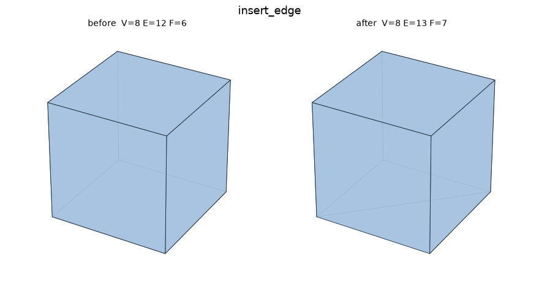

### #4 insert_edge_cross

Cross-face variant: when the two half-edges lie on different faces, those faces merge into one large face with the new edge traversed twice (once per direction) in the boundary loop. Topologically this adds a handle (genus +1). The geometry is the same straight line between two vertices, but the face structure changes: the two original faces become one connected face that loops through the new edge like a bridge.

**Blender addon selection**: same as insert_edge — select 4 vertices in order. V1→V2 on face A, V3→V4 on face B. The direction determines exactly which faces are merged, eliminating all ambiguity.

- **Signature**: `insert_edge(mesh, he1, he2) -> Edge`
- **Token**: `IE`
- **Oracle**: E+1, F−1 (two faces merge into one)
- **Parameters**: he1, he2 — half-edges on *different* faces
- **Differentiable (PyTorch)**: ✅ Yes — pure topology — no new vertex coordinates are created, so the position map is the identity and gradients pass through unchanged
- **Example primitive**: cube

```python
he0 = face_A.halfedges()[0]
he1 = face_B.halfedges()[0]
insert_edge(mesh, he0, he1)  # merge two faces
```

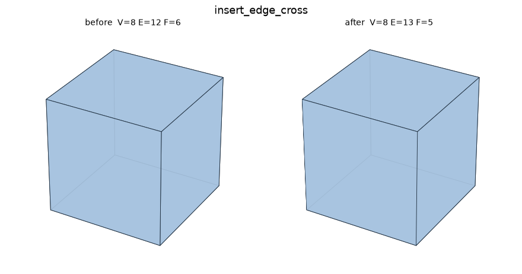

### #5 delete_edge

Deletes an edge. When the two sides of the edge belong to different faces, those faces merge into one (shown: removing one cube edge merges two squares into a hexagon). The inverse of `insert_edge`.

- **Signature**: `delete_edge(mesh, edge)`
- **Token**: `DE`
- **Oracle**: E−1; two distinct sides → F−1 (merge), same face both sides → F+1
- **Parameters**: —
- **Differentiable (PyTorch)**: ✅ Yes — pure topology — no new vertex coordinates are created, so the position map is the identity and gradients pass through unchanged
- **Example primitive**: cube

```python
delete_edge(mesh, edge)
```


---

## 2. High-Level Operators

### #6 extrude_face

Extrudes a face along its normal, creating a lifted copy of the face (the *top*) connected to the original boundary by n side quads — like pulling a box out of the surface. Returns `[top_face] + side_faces`. The building block of the DOME scheme.

- **Signature**: `extrude_face(mesh, face, dist=1.0) -> List[Face]`
- **Token**: `—`
- **Oracle**: V+n, E+2n, F+n (n = face degree)
- **Parameters**: dist — extrusion distance along the face normal
- **Differentiable (PyTorch)**: ✅ Yes — dedicated torch implementation: Newell face normal of the target face → new verts = old + dist × normal. Gradients flow to input positions and `dist`. Oracle: matches float path to 1e-9
- **Example primitive**: cube

```python
new_faces = extrude_face(mesh, face, dist=0.6)
top = new_faces[0]
```

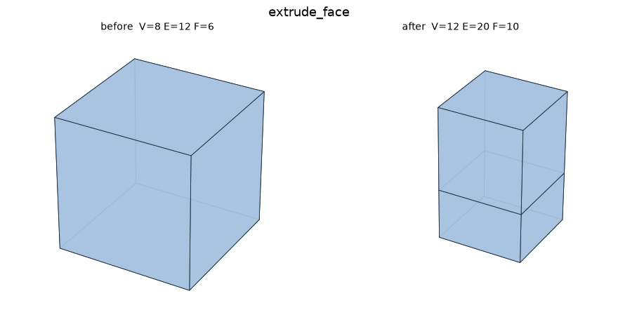

### #7 stellate

Stellates one face: adds an apex vertex at the face centroid (optionally raised along the normal) and connects it to every corner, turning one n-gon into n triangles — a pyramid grown on the face.

- **Signature**: `stellate(mesh, face, dist=0.0) -> Vertex`
- **Token**: `—`
- **Oracle**: V+1, E+n, F+n−1
- **Parameters**: dist — apex displacement along the face normal
- **Differentiable (PyTorch)**: ✅ Yes — dedicated torch implementation: centroid of the target face + optional dist × face normal. Gradients flow to input positions and `dist`. Oracle: matches float path to 1e-9
- **Example primitive**: cube

```python
apex = stellate(mesh, face)
```

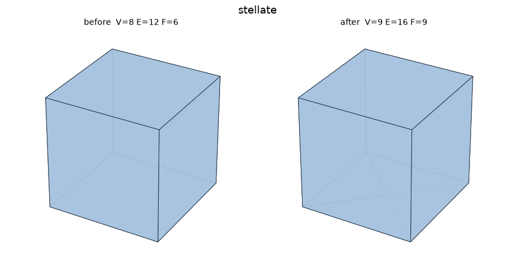

### #8 subdivide_edge

Splits an edge at its midpoint and returns the new midpoint vertex. The two flanking faces each gain one corner; no face is created or destroyed.

- **Signature**: `subdivide_edge(mesh, edge) -> Vertex`
- **Token**: `—`
- **Oracle**: V+1, E+1, F+0
- **Parameters**: —
- **Differentiable (PyTorch)**: ✅ Yes — dedicated torch implementation: midpoint = (v0 + v1) / 2. Gradients flow to the two endpoint vertices. Oracle: matches float path to 1e-9
- **Example primitive**: cube

```python
mid = subdivide_edge(mesh, edge)
```

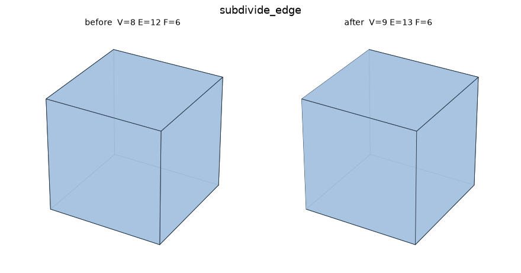

### #9 subdivide_face

Fans a face from its centroid: a center vertex is added and connected to every corner. Topologically identical to `stellate`, but the new vertex stays in the face plane instead of being lifted.

- **Signature**: `subdivide_face(mesh, face) -> Vertex`
- **Token**: `—`
- **Oracle**: V+1, E+n, F+n−1
- **Parameters**: —
- **Differentiable (PyTorch)**: ✅ Yes — identical to stellate at dist=0: centroid of the target face. Gradients flow to all face vertices. Oracle: matches float path to 1e-9
- **Example primitive**: cube

```python
c = subdivide_face(mesh, face)
```

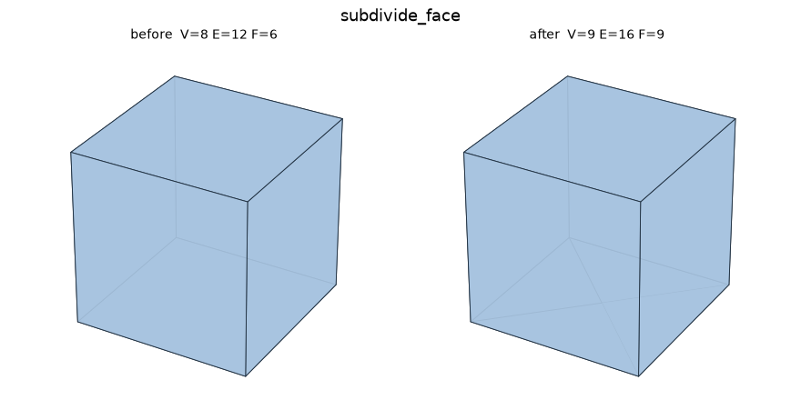

### #10 add_handle

Connects two faces of equal degree with a tunnel (handle): both faces are consumed and n side quads bridge their boundaries. This is the only operator that changes genus — a cube becomes a square torus (shown: tunnel between two opposite faces). It is also the hole-punching primitive for `create_crust` shells.

- **Signature**: `add_handle(mesh, face1, face2) -> List[Edge]`
- **Token**: `HDL`
- **Oracle**: V+0, E+n, F+n−2, χ−2, genus+1 (same component)
- **Parameters**: —
- **Differentiable (PyTorch)**: ✅ Yes — pure topology — no new vertex coordinates are created, so the position map is the identity and gradients pass through unchanged
- **Example primitive**: cube

```python
add_handle(mesh, top_face, bottom_face)
```

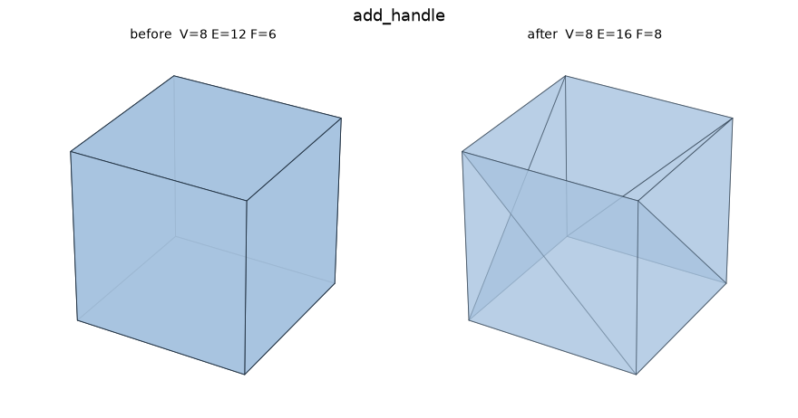

### #11 stellate_all

Stellates every face of the mesh at once, producing an all-triangle mesh (a pyramid on every face). Used as a building block inside the honeycomb and star schemes.

- **Signature**: `stellate_all(mesh) -> List[Vertex]  # in place`
- **Token**: `STA`
- **Oracle**: V'=V+F, E'=3E, F'=2E
- **Parameters**: —
- **Differentiable (PyTorch)**: ✅ Yes — linear — traced to a sparse matrix `W` in `topmod/diffgeo.py` (`new_verts = W @ old_verts`); gradients flow to input vertex positions. Op parameters are baked into the traced weights as constants. Oracle: torch output matches float implementation to 1e-9; verified by `torch.autograd.gradcheck`
- **Example primitive**: cube

```python
apexes = stellate_all(mesh)
```

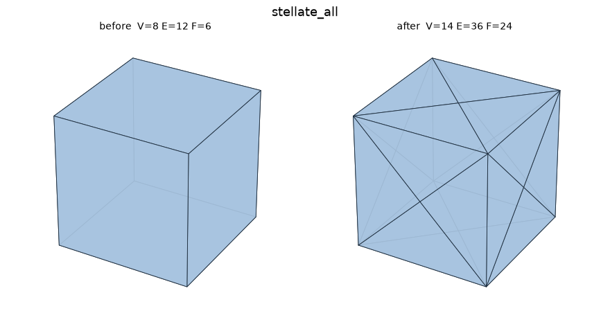

### #12 collapse_edge

Collapses an edge by merging its two endpoints into their midpoint. The two flanking faces degenerate and are removed. Shown: one edge of a cube collapsed, reducing to 7 vertices.

- **Signature**: `collapse_edge(mesh, edge) -> Vertex`
- **Token**: `—`
- **Oracle**: V−1, E−(d0+d1−3), F−2 (d0,d1 = degrees of flanking faces)
- **Parameters**: —
- **Differentiable (PyTorch)**: ❌ Not yet — not yet differentiable — topology-heavy operation that changes element count in ways difficult to trace
- **Example primitive**: cube

```python
mid = collapse_edge(mesh, edge)
```

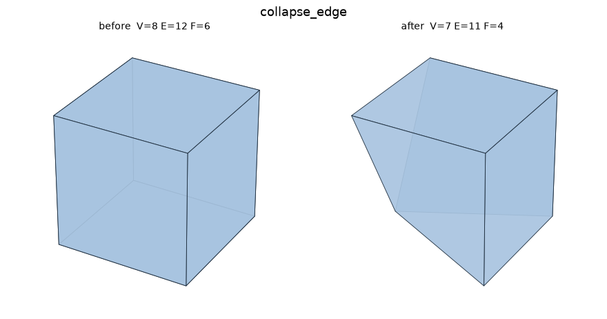

### #13 trisect_edge

Splits an edge into three segments by inserting two vertices at positions t1 and t2 along the original edge. The flanking faces each gain two corners. Default: equal trisection.

- **Signature**: `trisect_edge(mesh, edge, t1=1/3, t2=2/3) -> (Vertex, Vertex)`
- **Token**: `—`
- **Oracle**: V+2, E+2, F+0
- **Parameters**: t1, t2 ∈ (0,1) — split positions along the edge
- **Differentiable (PyTorch)**: ❌ Not yet — not yet differentiable — topology-heavy operation that changes element count in ways difficult to trace
- **Example primitive**: cube

```python
v1, v2 = trisect_edge(mesh, edge)
```

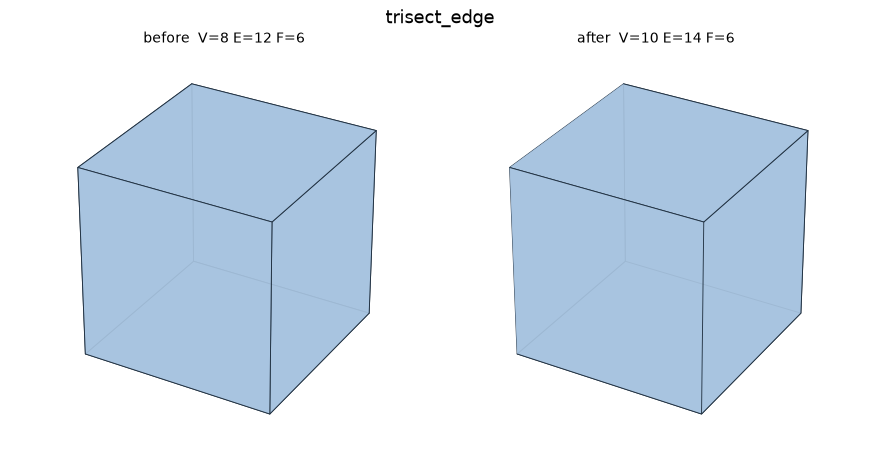

### #14 subdivide_all_edges

Subdivides every edge by inserting midpoints. This is the edge-refinement step used by doo_sabin_bc and other compound schemes. Face degrees double (each n-gon becomes a 2n-gon).

- **Signature**: `subdivide_all_edges(mesh, n_divs=2) -> List[Vertex]`
- **Token**: `SAE`
- **Oracle**: V'=V+E, E'=2E, F unchanged (for n_divs=2)
- **Parameters**: n_divs — number of segments per edge (default 2 = midpoint)
- **Differentiable (PyTorch)**: ✅ Yes — linear — traced to a sparse matrix `W` in `topmod/diffgeo.py` (`new_verts = W @ old_verts`); gradients flow to input vertex positions. Op parameters are baked into the traced weights as constants. Oracle: torch output matches float implementation to 1e-9; verified by `torch.autograd.gradcheck`
- **Example primitive**: cube

```python
new_verts = subdivide_all_edges(mesh)
```


### #15 subdivide_all_faces

Subdivides every face by connecting its centroid to all corners (= stellate_all with apex at height 0, i.e. in the face plane). Topologically identical to stellate_all.

- **Signature**: `subdivide_all_faces(mesh) -> List[Vertex]`
- **Token**: `—`
- **Oracle**: V'=V+F, E'=3E, F'=2E
- **Parameters**: —
- **Differentiable (PyTorch)**: ✅ Yes — linear — traced to a sparse matrix `W` in `topmod/diffgeo.py` (`new_verts = W @ old_verts`); gradients flow to input vertex positions. Op parameters are baked into the traced weights as constants. Oracle: torch output matches float implementation to 1e-9; verified by `torch.autograd.gradcheck`
- **Example primitive**: cube

```python
centers = subdivide_all_faces(mesh)
```

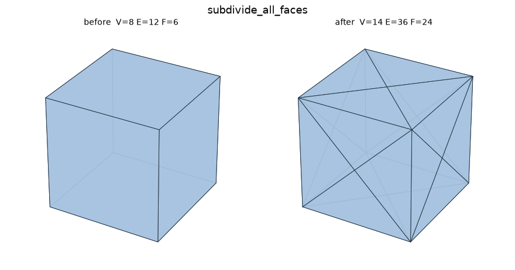

### #16 triangulate_face

Triangulates one face by fan from its first vertex. An n-gon becomes n−2 triangles via n−3 inserted diagonal edges. Shown: one quad face of a cube triangulated into 2 triangles.

- **Signature**: `triangulate_face(mesh, face)`
- **Token**: `—`
- **Oracle**: V+0, E+(n−3), F+(n−3) for an n-gon
- **Parameters**: —
- **Differentiable (PyTorch)**: ✅ Yes — pure topology — no new vertex coordinates are created, so the position map is the identity and gradients pass through unchanged
- **Example primitive**: cube

```python
triangulate_face(mesh, face)
```

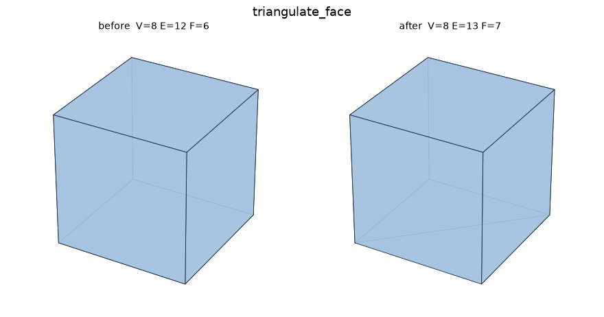

### #17 triangulate_all

Triangulates every face by fan from its first vertex. Converts the entire mesh to triangles. On a cube (all quads), each quad becomes 2 triangles: E=12→18, F=6→12.

- **Signature**: `triangulate_all(mesh)`
- **Token**: `TRI`
- **Oracle**: V+0, E+Σ(d_i−3), F+Σ(d_i−3)
- **Parameters**: —
- **Differentiable (PyTorch)**: ✅ Yes — pure topology — no new vertex coordinates are created, so the position map is the identity and gradients pass through unchanged
- **Example primitive**: cube

```python
triangulate_all(mesh)
```

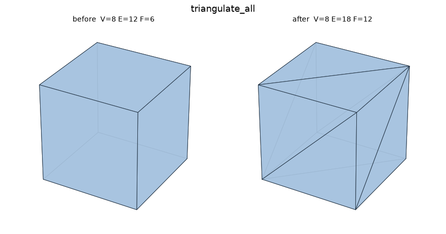

### #18 double_stellate_face

Double-stellates a face: stellate it once (creating n triangles), then stellate each resulting triangle. Produces a spiky, fractal protrusion on a single face.

- **Signature**: `double_stellate_face(mesh, face, dist=0.0) -> Vertex`
- **Token**: `—`
- **Oracle**: V+(1+n), E+(n+3n), F+(n−1+3n−n) (complex)
- **Parameters**: dist — first apex displacement along face normal
- **Differentiable (PyTorch)**: ✅ Yes — dedicated torch implementation: two rounds of stellate with centroid + normal apex computation. Gradients flow to input positions and `dist`
- **Example primitive**: cube

```python
apex = double_stellate_face(mesh, face, dist=0.5)
```

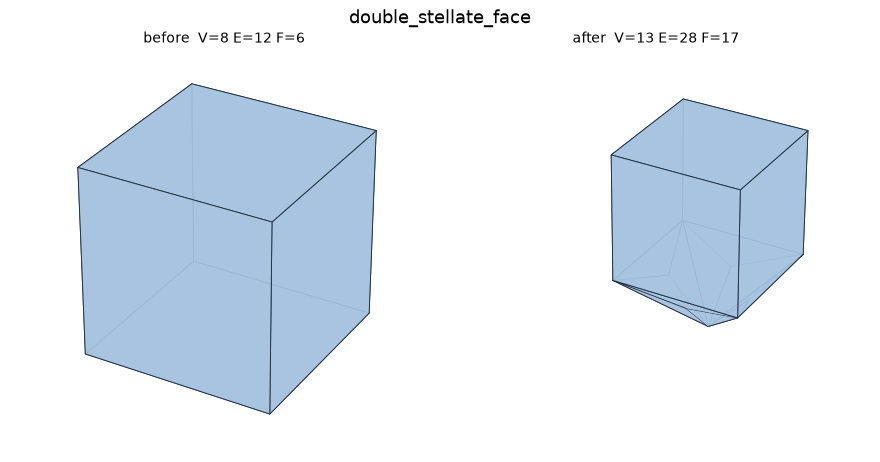

### #19 stellate_subdivide

Stellate subdivision: stellate every face, then delete all original edges (merging adjacent triangles). Different from plain stellate_all which keeps original edges. Creates a dual-like mesh with new faces bridging original vertices.

- **Signature**: `stellate_subdivide(mesh)  # in place`
- **Token**: `STSUB`
- **Oracle**: V'=V+F, E'=2·Σd_i, F'=Σd_i (varies)
- **Parameters**: —
- **Differentiable (PyTorch)**: ✅ Yes — linear — traced to a sparse matrix `W` in `topmod/diffgeo.py` (`new_verts = W @ old_verts`); gradients flow to input vertex positions. Op parameters are baked into the traced weights as constants. Oracle: torch output matches float implementation to 1e-9; verified by `torch.autograd.gradcheck`
- **Example primitive**: cube

```python
stellate_subdivide(mesh)
```

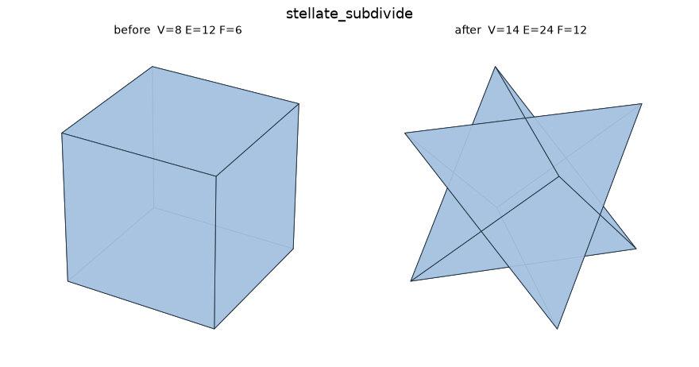

### #20 punch_hole

Alias for `add_handle` — punches a hole/tunnel between two faces. Included for semantic clarity in workflows where the intent is hole-making (e.g. after `create_crust`).

- **Signature**: `punch_hole(mesh, face1, face2) -> List[Edge]`
- **Token**: `—`
- **Oracle**: same as add_handle
- **Parameters**: —
- **Differentiable (PyTorch)**: ✅ Yes — pure topology — no new vertex coordinates are created, so the position map is the identity and gradients pass through unchanged
- **Example primitive**: cube

```python
punch_hole(mesh, face_outer, face_inner)
```

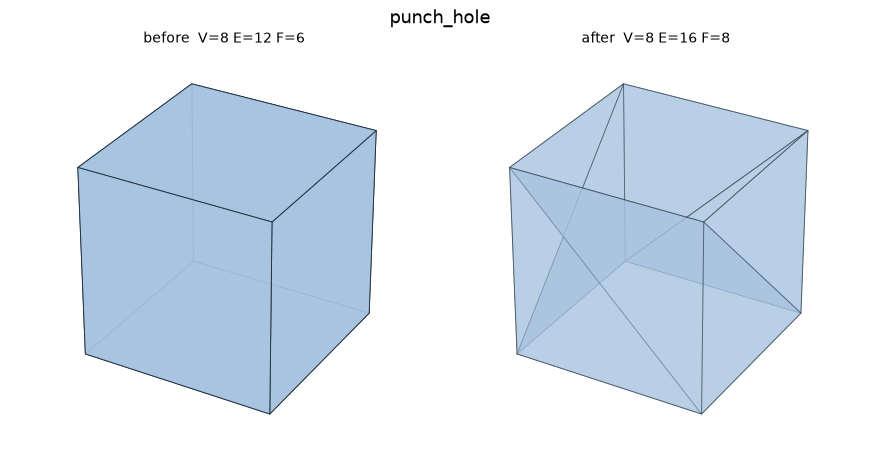

### #21 extrude_face_dome

Dome-shaped extrusion on a single selected face. Five successive DS-style extrusions with decreasing height and increasing scale, then a final stellation closes the dome apex. Creates a smooth bump on one face rather than the whole mesh.

- **Signature**: `extrude_face_dome(mesh, face, length=1.0, sf=1.0) -> Face`
- **Token**: `—`
- **Oracle**: V+~5n, E+~10n, F+~5n (n = face degree, 5 extrusion rounds)
- **Parameters**: length — height scale; sf — ring scale
- **Differentiable (PyTorch)**: ✅ Yes — dedicated torch implementation: 5 rounds of DS-style extrusion with Newell normals + final stellate. Gradients flow to input positions, `length` and `sf`
- **Example primitive**: cube

```python
top = extrude_face_dome(mesh, face)
```

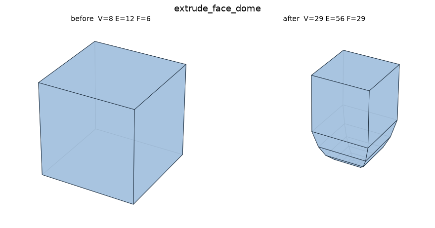

### #22 make_wireframe

Wireframe generation: modified_corner_cutting → create_crust → punch matching holes. Converts a solid into a hollow wireframe where each original edge becomes a beam and each original face becomes a hole. Returns a new mesh.

- **Signature**: `make_wireframe(mesh, thickness=0.1) -> DLFLMesh`
- **Token**: `—`
- **Oracle**: complex (MCC → crust → punch holes)
- **Parameters**: thickness — beam width
- **Differentiable (PyTorch)**: ❌ Not yet — not yet differentiable — topology-heavy operation that changes element count in ways difficult to trace
- **Example primitive**: cube

```python
wire = make_wireframe(mesh, thickness=0.15)
```

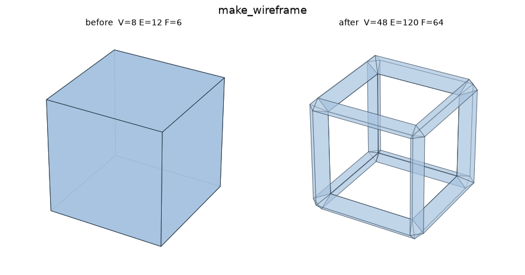

---

## 3. Classic Subdivision

### #23 catmull_clark

Catmull-Clark subdivision, the industry-standard smoothing scheme: face points, edge points and repositioned vertex points split every face into quads while pulling the surface toward a smooth limit surface. Output is always an all-quad mesh.

- **Signature**: `catmull_clark(mesh) -> DLFLMesh`
- **Token**: `CC`
- **Oracle**: V'=V+E+F, E'=4E, F'=2E (all quads)
- **Parameters**: —
- **Differentiable (PyTorch)**: ✅ Yes — linear — traced to a sparse matrix `W` in `topmod/diffgeo.py` (`new_verts = W @ old_verts`); gradients flow to input vertex positions. Op parameters are baked into the traced weights as constants. Oracle: torch output matches float implementation to 1e-9; verified by `torch.autograd.gradcheck`
- **Example primitive**: cube

```python
out = catmull_clark(mesh)
```

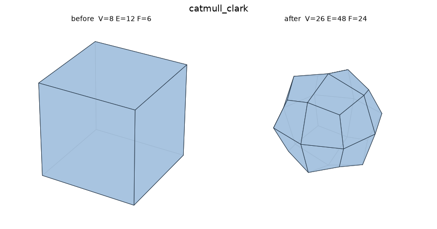

### #24 dual

Takes the combinatorial dual: every face becomes a vertex (at its centroid) and every vertex becomes a face. Applying it twice returns the original topology: `dual(dual(M)) ≅ M`. A cube maps to an octahedron and vice versa.

- **Signature**: `dual(mesh) -> DLFLMesh`
- **Token**: `DUAL`
- **Oracle**: V'=F, E'=E, F'=V
- **Parameters**: —
- **Differentiable (PyTorch)**: ✅ Yes — linear — traced to a sparse matrix `W` in `topmod/diffgeo.py` (`new_verts = W @ old_verts`); gradients flow to input vertex positions. Op parameters are baked into the traced weights as constants. Oracle: torch output matches float implementation to 1e-9; verified by `torch.autograd.gradcheck`
- **Example primitive**: cube

```python
out = dual(mesh)
```

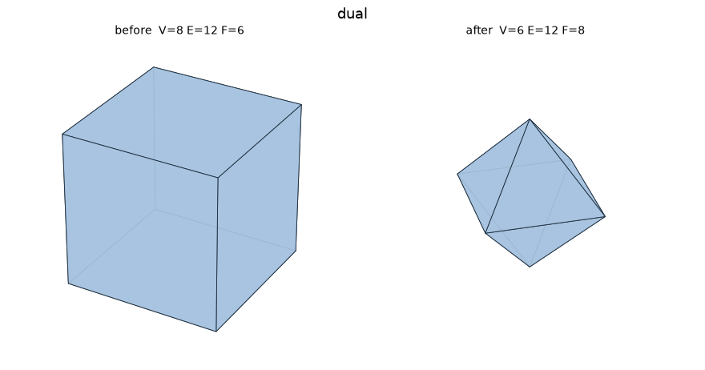

### #25 doo_sabin

Doo-Sabin subdivision (corner-cutting family): one new vertex per face corner, producing shrunken *face-faces*, quad *edge-faces*, and *vertex-faces* — every sharp corner and edge of the input gets beveled away.

- **Signature**: `doo_sabin(mesh) -> DLFLMesh`
- **Token**: `DS`
- **Oracle**: V'=2E, E'=4E, F'=V+E+F
- **Parameters**: —
- **Differentiable (PyTorch)**: ✅ Yes — linear — traced to a sparse matrix `W` in `topmod/diffgeo.py` (`new_verts = W @ old_verts`); gradients flow to input vertex positions. Op parameters are baked into the traced weights as constants. Oracle: torch output matches float implementation to 1e-9; verified by `torch.autograd.gradcheck`
- **Example primitive**: cube

```python
out = doo_sabin(mesh)
```

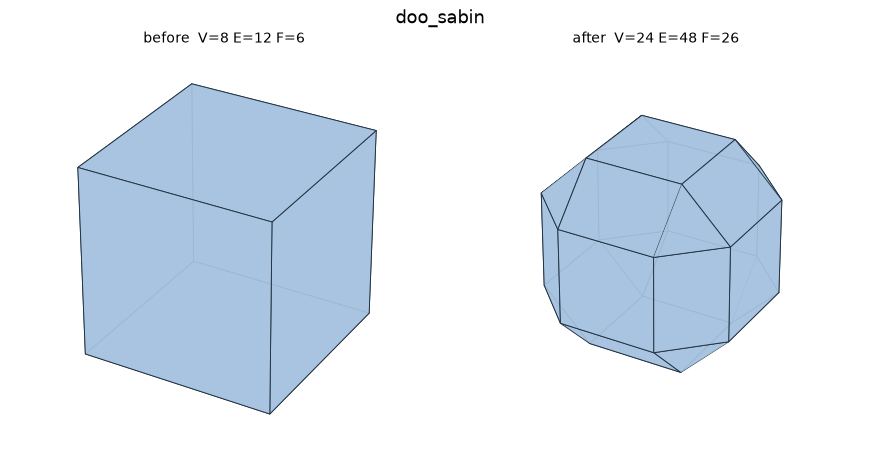

### #26 simplest_subdivide

Mid-edge (simplest / Peters-Reif) subdivision: edge midpoints become the only vertices; each face shrinks to its midpoint polygon and each old vertex is replaced by a new face. A cube becomes a cuboctahedron.

- **Signature**: `simplest_subdivide(mesh) -> DLFLMesh`
- **Token**: `SIMP`
- **Oracle**: V'=E, E'=2E, F'=F+V
- **Parameters**: —
- **Differentiable (PyTorch)**: ✅ Yes — linear — traced to a sparse matrix `W` in `topmod/diffgeo.py` (`new_verts = W @ old_verts`); gradients flow to input vertex positions. Op parameters are baked into the traced weights as constants. Oracle: torch output matches float implementation to 1e-9; verified by `torch.autograd.gradcheck`
- **Example primitive**: cube

```python
out = simplest_subdivide(mesh)
```

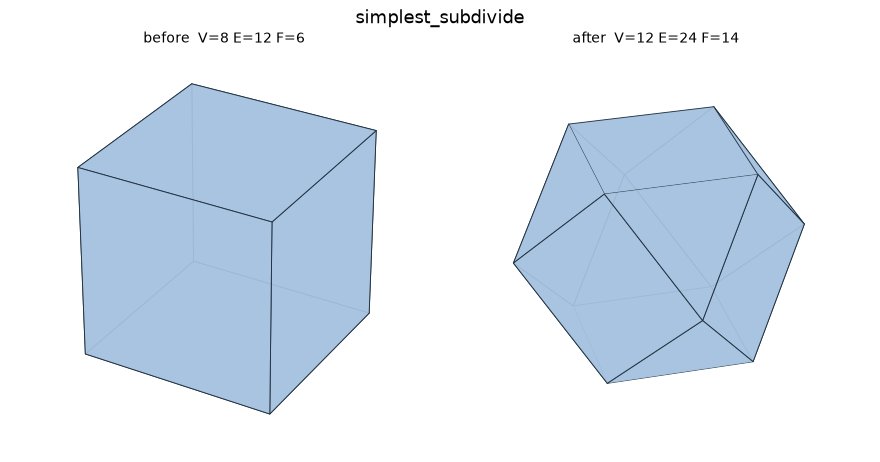

### #27 vertex_cutting

Vertex truncation: every vertex is sliced off, leaving a small polygon where the corner was, and every n-gon becomes a 2n-gon. A cube becomes a truncated cube.

- **Signature**: `vertex_cutting(mesh, offset=0.25) -> DLFLMesh`
- **Token**: `VC`
- **Oracle**: V'=2E, E'=3E, F'=F+V
- **Parameters**: offset ∈ (0, 0.5) — corner-cut depth
- **Differentiable (PyTorch)**: ✅ Yes — linear — traced to a sparse matrix `W` in `topmod/diffgeo.py` (`new_verts = W @ old_verts`); gradients flow to input vertex positions. Op parameters are baked into the traced weights as constants. Oracle: torch output matches float implementation to 1e-9; verified by `torch.autograd.gradcheck`
- **Example primitive**: cube

```python
out = vertex_cutting(mesh, offset=0.25)
```

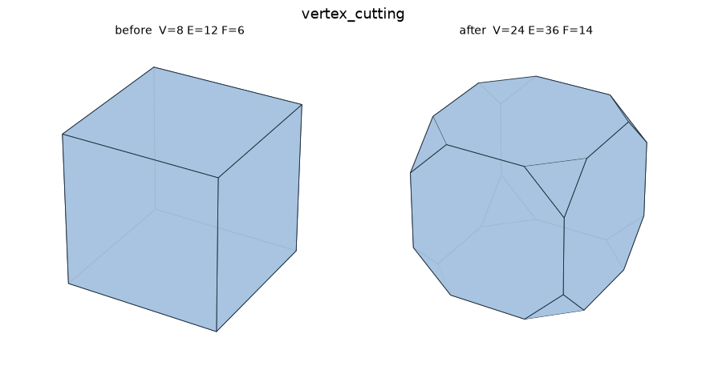

### #28 loop_subdivide

Loop subdivision: every triangle is split 1-into-4 at edge midpoints, with β-weighted smoothing of old vertices — the standard smooth scheme for triangle meshes. Raises ValueError on non-triangle input.

- **Signature**: `loop_subdivide(mesh) -> DLFLMesh  # triangle meshes only`
- **Token**: `LOOP`
- **Oracle**: V'=V+E, E'=4E, F'=4F
- **Parameters**: —
- **Differentiable (PyTorch)**: ✅ Yes — linear — traced to a sparse matrix `W` in `topmod/diffgeo.py` (`new_verts = W @ old_verts`); gradients flow to input vertex positions. Op parameters are baked into the traced weights as constants. Oracle: torch output matches float implementation to 1e-9; verified by `torch.autograd.gradcheck`
- **Example primitive**: icosahedron

```python
out = loop_subdivide(make_icosahedron())
```

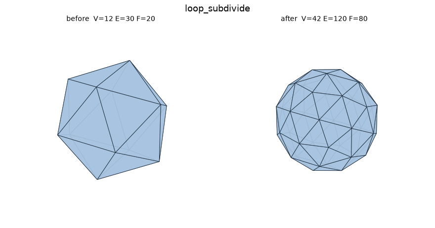

### #29 sqrt3_subdivide

√3 subdivision (Kobbelt): a vertex is inserted at every face centroid, then all original edges are flipped, tripling the triangle count with the slowest possible growth rate. Raises ValueError on non-triangle input.

- **Signature**: `sqrt3_subdivide(mesh) -> DLFLMesh  # triangle meshes only`
- **Token**: `SQRT3`
- **Oracle**: V'=V+F, E'=3E, F'=3F
- **Parameters**: —
- **Differentiable (PyTorch)**: ✅ Yes — linear — traced to a sparse matrix `W` in `topmod/diffgeo.py` (`new_verts = W @ old_verts`); gradients flow to input vertex positions. Op parameters are baked into the traced weights as constants. Oracle: torch output matches float implementation to 1e-9; verified by `torch.autograd.gradcheck`
- **Example primitive**: icosahedron

```python
out = sqrt3_subdivide(make_icosahedron())
```

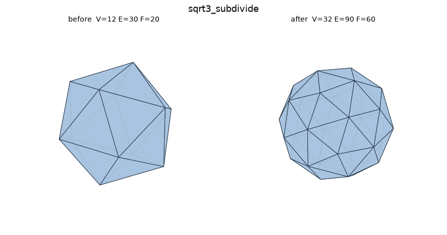

---

## 4. TopMod Remeshing Schemes

### #30 honeycomb_subdivide

Honeycomb subdivision, defined as `dual ∘ stellate_all`: stellate every face, then dualize. Triangle input yields a hexagon-dominated (honeycomb-like) mesh.

- **Signature**: `honeycomb_subdivide(mesh) -> DLFLMesh`
- **Token**: `HONEY`
- **Oracle**: V'=2E, E'=3E, F'=F+V
- **Parameters**: —
- **Differentiable (PyTorch)**: ✅ Yes — linear — traced to a sparse matrix `W` in `topmod/diffgeo.py` (`new_verts = W @ old_verts`); gradients flow to input vertex positions. Op parameters are baked into the traced weights as constants. Oracle: torch output matches float implementation to 1e-9; verified by `torch.autograd.gradcheck`
- **Example primitive**: cube

```python
out = honeycomb_subdivide(mesh)
```

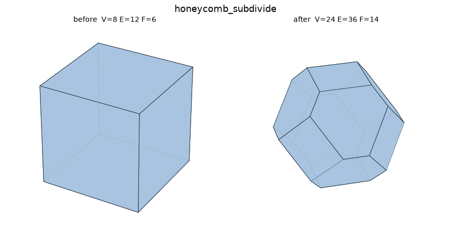

### #31 star_subdivide

Star subdivision: `stellate_all` applied twice. A positive offset lifts the first round of apexes along the original face normals, growing star-like spikes on every face.

- **Signature**: `star_subdivide(mesh, offset=0.0)  # in place`
- **Token**: `STAR`
- **Oracle**: V'=V+F+2E, E'=9E, F'=6E (all triangles)
- **Parameters**: offset — first-round apex lift along original face normals
- **Differentiable (PyTorch)**: ✅ Yes — decomposed as linear STA×2 (traced sparse matrices) + post-hoc offset · face-normal correction on first-round apexes. Gradients flow to input positions and `offset`. Oracle: matches float path to 1e-9
- **Example primitive**: cube

```python
star_subdivide(mesh, offset=0.3)
```

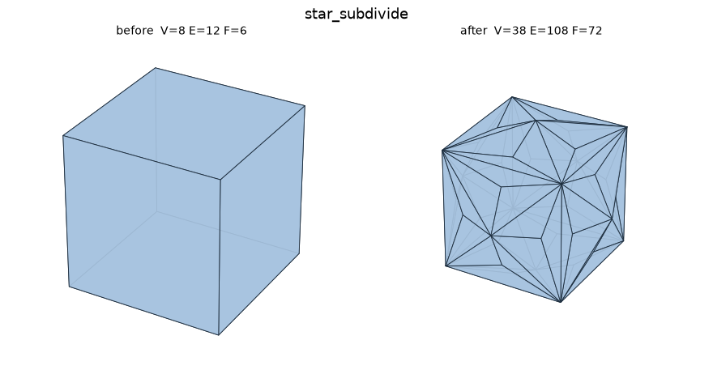

### #32 corner_cutting

Corner-cutting subdivision: a parameterized geometric variant of Doo-Sabin with identical connectivity. `alpha` controls how close each new corner stays to the original corner, i.e. how aggressively corners are shaved off.

- **Signature**: `corner_cutting(mesh, alpha=0.5) -> DLFLMesh`
- **Token**: `CCUT`
- **Oracle**: V'=2E, E'=4E, F'=V+E+F (same topology as Doo-Sabin)
- **Parameters**: alpha ∈ (0, 1) — tension (diagonal weight)
- **Differentiable (PyTorch)**: ✅ Yes — linear — traced to a sparse matrix `W` in `topmod/diffgeo.py` (`new_verts = W @ old_verts`); gradients flow to input vertex positions. Op parameters are baked into the traced weights as constants. Oracle: torch output matches float implementation to 1e-9; verified by `torch.autograd.gradcheck`
- **Example primitive**: cube

```python
out = corner_cutting(mesh, alpha=0.7)
```

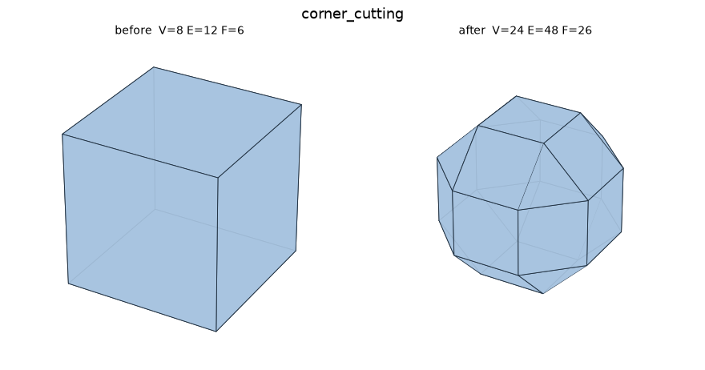

### #33 loop_style_subdivide

Loop connectivity generalized to arbitrary polygons: each face gets its corner triangles cut off, leaving a central midpoint d-gon. On triangle input the connectivity coincides exactly with Loop subdivision.

- **Signature**: `loop_style_subdivide(mesh, length=1.0) -> DLFLMesh`
- **Token**: `LSTYLE`
- **Oracle**: V'=V+E, E'=4E, F'=F+2E
- **Parameters**: length ∈ [0, 1] — old-vertex blend (1 = keep position)
- **Differentiable (PyTorch)**: ✅ Yes — linear — traced to a sparse matrix `W` in `topmod/diffgeo.py` (`new_verts = W @ old_verts`); gradients flow to input vertex positions. Op parameters are baked into the traced weights as constants. Oracle: torch output matches float implementation to 1e-9; verified by `torch.autograd.gradcheck`
- **Example primitive**: cube

```python
out = loop_style_subdivide(mesh)
```


### #34 fractal_subdivide

Fractal subdivision: `loop_style` followed by stellating every central polygon with an apex raised along the face normal. Repeated application produces a fractal, spiky landscape.

- **Signature**: `fractal_subdivide(mesh, offset=1.0) -> DLFLMesh`
- **Token**: `FRAC`
- **Oracle**: V'=V+E+F, E'=6E, F'=4E (all triangles)
- **Parameters**: offset — spike height factor
- **Differentiable (PyTorch)**: ✅ Yes — decomposed as linear LSTYLE trace (shared vertex positions) + torch apex computation: centroid + h · normal, where h = offset · √max(L2²−L1², 0) with gradient-safe sqrt guard. Gradients flow to input positions and `offset`. Oracle: matches float path to 1e-9
- **Example primitive**: cube

```python
out = fractal_subdivide(mesh, offset=1.0)
```

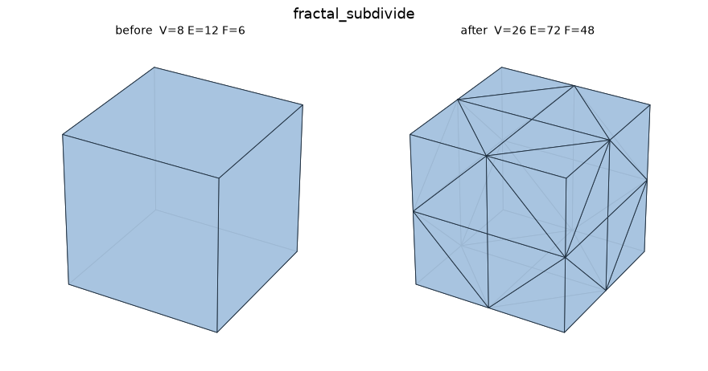

### #35 pentagonal_subdivide

Pentagonal subdivision: every edge is trisected and every face gets a centroid spoke, converting each d-gon into d pentagons — the whole mesh becomes all-pentagon. A tetrahedron maps to the combinatorial structure of a regular dodecahedron.

- **Signature**: `pentagonal_subdivide(mesh, offset=0.0) -> DLFLMesh`
- **Token**: `PENT`
- **Oracle**: V'=V+2E+F, E'=5E, F'=2E (all pentagons)
- **Parameters**: offset ∈ [0, 1] — pull spoke neighbors toward the centroid
- **Differentiable (PyTorch)**: ✅ Yes — linear — traced to a sparse matrix `W` in `topmod/diffgeo.py` (`new_verts = W @ old_verts`); gradients flow to input vertex positions. Op parameters are baked into the traced weights as constants. Oracle: torch output matches float implementation to 1e-9; verified by `torch.autograd.gradcheck`
- **Example primitive**: cube

```python
out = pentagonal_subdivide(mesh)
```

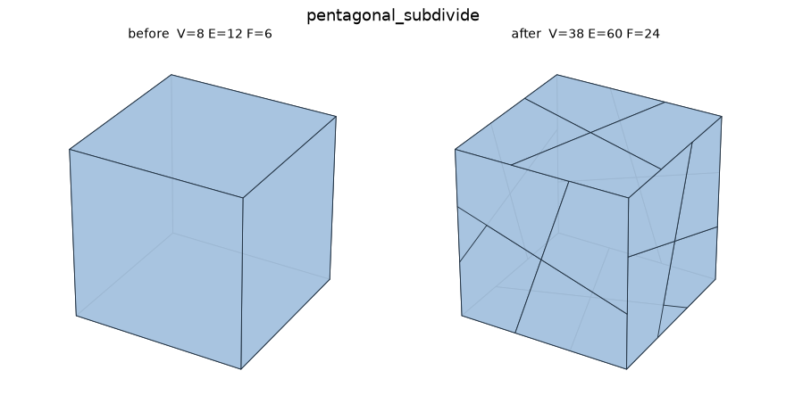

### #36 pentagonal2_subdivide

Second pentagonal variant: edges are split at midpoints and a scaled inner copy of each face is inserted, then connected — each face becomes one inner d-gon surrounded by d pentagons.

- **Signature**: `pentagonal2_subdivide(mesh, scale_factor=0.75) -> DLFLMesh`
- **Token**: `PENT2`
- **Oracle**: V'=V+3E, E'=6E, F'=F+2E
- **Parameters**: scale_factor — inner-polygon shrink
- **Differentiable (PyTorch)**: ✅ Yes — linear — traced to a sparse matrix `W` in `topmod/diffgeo.py` (`new_verts = W @ old_verts`); gradients flow to input vertex positions. Op parameters are baked into the traced weights as constants. Oracle: torch output matches float implementation to 1e-9; verified by `torch.autograd.gradcheck`
- **Example primitive**: cube

```python
out = pentagonal2_subdivide(mesh, scale_factor=0.7)
```

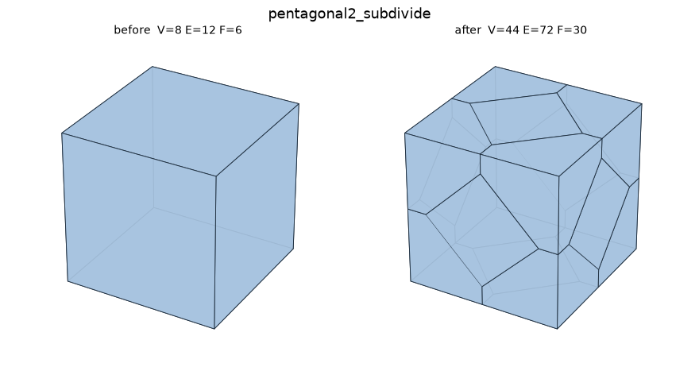

### #37 dual1264_subdivide

Dual 12.6.4 subdivision: Doo-Sabin-like, but each face's inner polygon is a 2d-gon built from the 1/3 and 2/3 points of every edge. Triangle input produces the semi-regular 12.6.4 tiling pattern (dodecagons, hexagons, squares).

- **Signature**: `dual1264_subdivide(mesh, sf=1.0) -> DLFLMesh`
- **Token**: `D1264`
- **Oracle**: V'=4E, E'=6E, F'=F+E+V
- **Parameters**: sf — inner-polygon scale
- **Differentiable (PyTorch)**: ✅ Yes — linear — traced to a sparse matrix `W` in `topmod/diffgeo.py` (`new_verts = W @ old_verts`); gradients flow to input vertex positions. Op parameters are baked into the traced weights as constants. Oracle: torch output matches float implementation to 1e-9; verified by `torch.autograd.gradcheck`
- **Example primitive**: cube

```python
out = dual1264_subdivide(mesh)
```

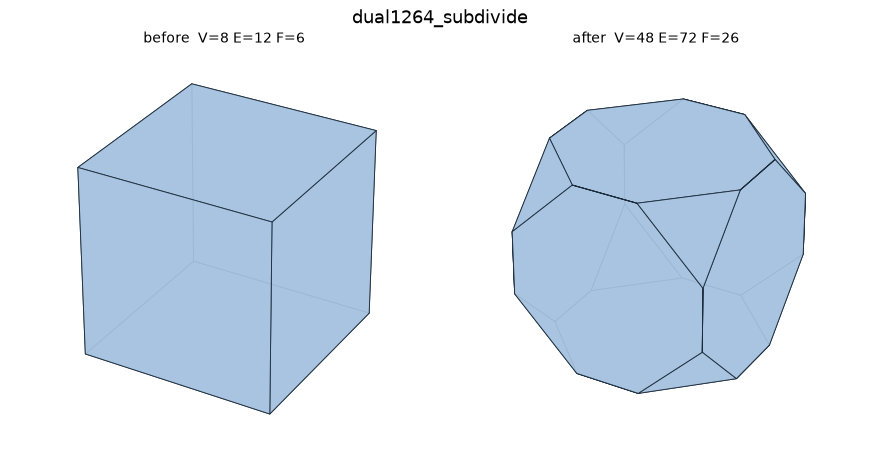

### #38 root4_subdivide

Root-4 subdivision: an inner polygon (honeycomb-mask weighted) is inserted in every face and bridged to neighbors with hexagons, while all original edges are deleted. Unlike Doo-Sabin, the original vertices survive.

- **Signature**: `root4_subdivide(mesh, a=0.0, twist=0.0) -> DLFLMesh`
- **Token**: `ROOT4`
- **Oracle**: V'=V+2E, E'=4E, F'=F+E
- **Parameters**: a — old-vertex smoothing blend; twist — inner-ring sampling shift
- **Differentiable (PyTorch)**: ✅ Yes — linear — traced to a sparse matrix `W` in `topmod/diffgeo.py` (`new_verts = W @ old_verts`); gradients flow to input vertex positions. Op parameters are baked into the traced weights as constants. Oracle: torch output matches float implementation to 1e-9; verified by `torch.autograd.gradcheck`
- **Example primitive**: cube

```python
out = root4_subdivide(mesh, a=0.3, twist=0.2)
```

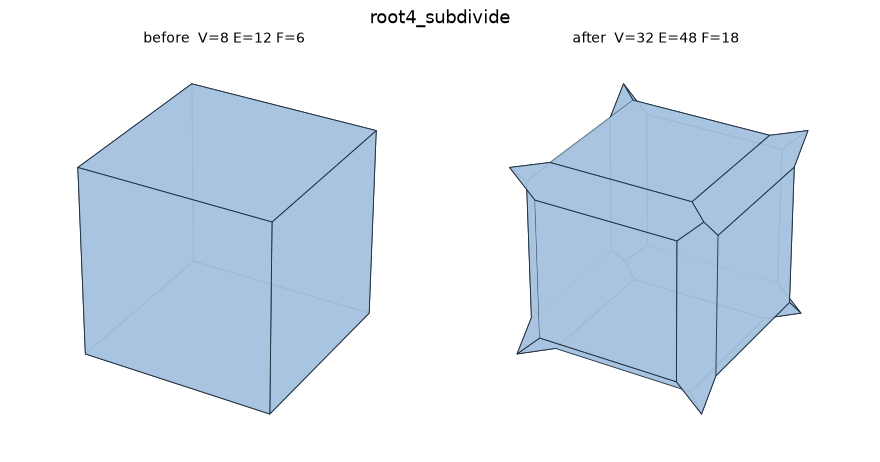

### #39 checkerboard_remesh

Checkerboard remeshing: each face is inset, each edge trisected, and corners are chamfered, producing an alternating quad pattern. Quad input stays all-quad, with a visible checkerboard layout.

- **Signature**: `checkerboard_remesh(mesh, thickness=0.25) -> DLFLMesh`
- **Token**: `CHKB`
- **Oracle**: V'=V+4E, E'=9E, F'=F+4E
- **Parameters**: thickness ∈ (0, 0.5) — inset / trisection ratio
- **Differentiable (PyTorch)**: ✅ Yes — linear — traced to a sparse matrix `W` in `topmod/diffgeo.py` (`new_verts = W @ old_verts`); gradients flow to input vertex positions. Op parameters are baked into the traced weights as constants. Oracle: torch output matches float implementation to 1e-9; verified by `torch.autograd.gradcheck`
- **Example primitive**: cube

```python
out = checkerboard_remesh(mesh, thickness=0.25)
```

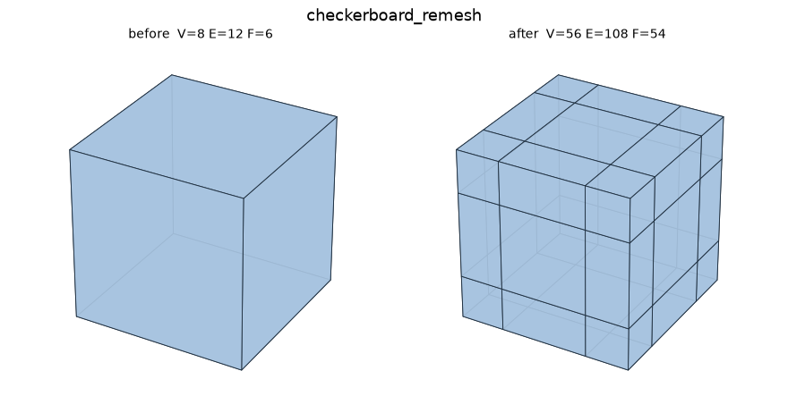

### #40 ds_bc_new_subdivide

Doo-Sabin "BC new" variant: a Doo-Sabin pass is applied to the midpoint-refined 2d-gon boundary of every face, but the original vertices survive. Each face yields one 2d-gon plus two pentagons per edge.

- **Signature**: `ds_bc_new_subdivide(mesh, sf=1.0, length=1.0) -> DLFLMesh`
- **Token**: `DSBC`
- **Oracle**: V'=V+4E, E'=7E, F'=F+2E
- **Parameters**: sf — DS corner scale; length — old-vertex blend
- **Differentiable (PyTorch)**: ✅ Yes — linear — traced to a sparse matrix `W` in `topmod/diffgeo.py` (`new_verts = W @ old_verts`); gradients flow to input vertex positions. Op parameters are baked into the traced weights as constants. Oracle: torch output matches float implementation to 1e-9; verified by `torch.autograd.gradcheck`
- **Example primitive**: cube

```python
out = ds_bc_new_subdivide(mesh, sf=0.9)
```

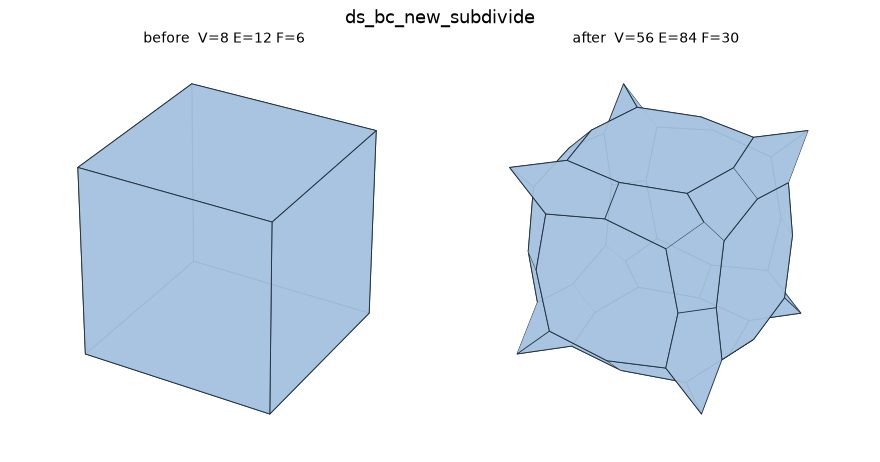

### #41 dome_subdivide

Dome subdivision: every edge is split into quarters, then every original face is extruded seven times with a built-in height/scale profile, growing a rounded dome on each face — the mesh sprouts a bubble on every side.

- **Signature**: `dome_subdivide(mesh, length=1.0, sf=1.0)  # in place`
- **Token**: `DOME`
- **Oracle**: V'=V+59E, E'=116E, F'=F+56E
- **Parameters**: length — height profile scale; sf — ring scale profile
- **Differentiable (PyTorch)**: ✅ Yes — full torch reconstruction: quadrisection (linear midpoints) + 7 rounds of Newell-normal extrusion + DS-mask ring repositioning + centroid scaling. Gradients flow to input positions, `length` and `sf`. Oracle: position-matched to 7.6e-18 (vertex order differs from float in-place path, verified by bijective nearest-neighbor)
- **Example primitive**: cube

```python
dome_subdivide(mesh)
```

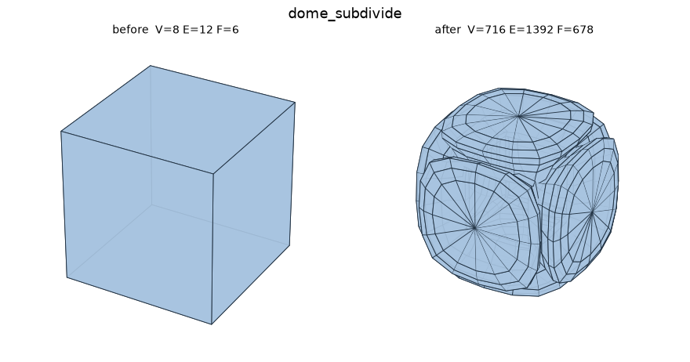

### #42 doo_sabin_bc

Doo-Sabin BC: subdivide all edges (midpoint split) then apply Doo-Sabin on the result. The edge subdivision doubles face degrees before DS acts, producing a denser, smoother result than plain Doo-Sabin.

- **Signature**: `doo_sabin_bc(mesh) -> DLFLMesh`
- **Token**: `—`
- **Oracle**: complex (subdivide_all_edges then doo_sabin)
- **Parameters**: —
- **Differentiable (PyTorch)**: ✅ Yes — composed: linear SAE trace then DS trace, two sparse matrices chained. Gradients flow to input positions
- **Example primitive**: cube

```python
out = doo_sabin_bc(mesh)
```

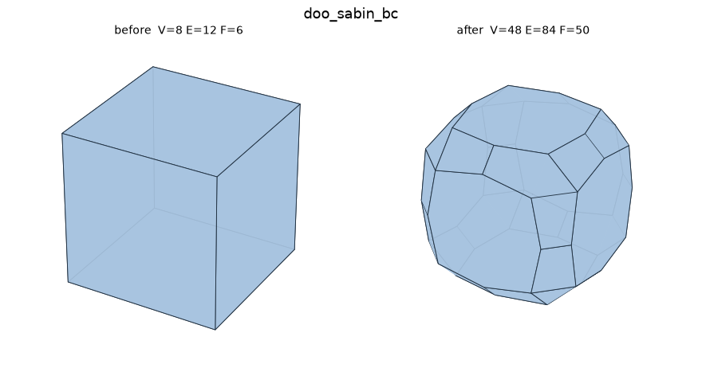

### #43 two_stellate_subdivide

Two-pass stellate subdivision: stellate every original face (pass 1), then stellate ALL faces including pass-1 triangles (pass 2), then delete all edges that existed before pass 2. Creates a spiky, organic surface texture.

- **Signature**: `two_stellate_subdivide(mesh, offset=0.0, curve=0.0)`
- **Token**: `—`
- **Oracle**: complex (2-pass stellate + edge deletion)
- **Parameters**: offset — pass-1 apex displacement; curve — pass-2 displacement
- **Differentiable (PyTorch)**: ✅ Yes — decomposed: STA round 1 + normal correction + STA round 2 + curve correction. Gradients flow to input positions, `offset` and `curve`
- **Example primitive**: cube

```python
two_stellate_subdivide(mesh, offset=0.15)
```

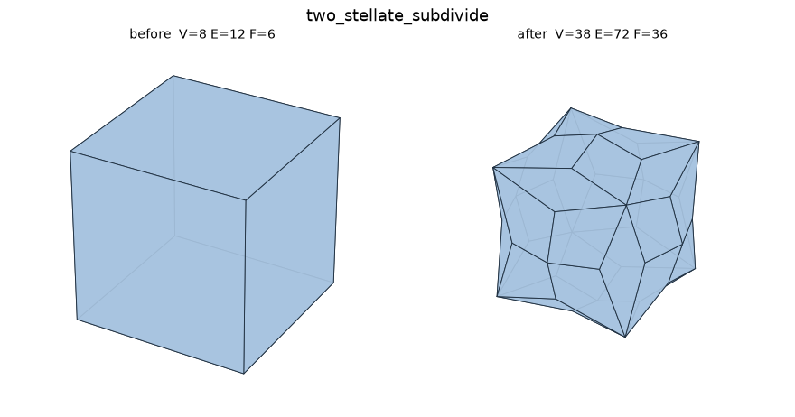

### #44 modified_corner_cutting

Modified corner-cutting: each face gets an inset copy where vertices are pushed inward along the bisector of adjacent edges. Original geometry is replaced; inner faces are bridged with quad strips. Same connectivity as Doo-Sabin but different vertex placement. Used as the first step of make_wireframe.

- **Signature**: `modified_corner_cutting(mesh, thickness=0.25) -> DLFLMesh`
- **Token**: `MCC`
- **Oracle**: V'=2E, E'≈5E, F'=V+F (DS topology)
- **Parameters**: thickness — inset distance along edge bisectors
- **Differentiable (PyTorch)**: ✅ Yes — dedicated torch implementation: direction normalization (bisector/scale) for vertex positions. Gradients flow to input positions and `thickness`/`scale`
- **Example primitive**: cube

```python
out = modified_corner_cutting(mesh, thickness=0.2)
```

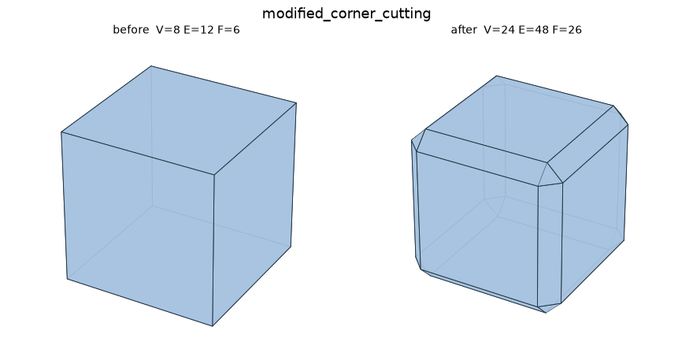

### #45 modified_corner_cutting2

Variant 2 of modified corner-cutting: same topology as MCC but vertex positions use a uniform scale displacement along the sum of neighbor directions instead of bisector-based thickness.

- **Signature**: `modified_corner_cutting2(mesh, scale=0.25) -> DLFLMesh`
- **Token**: `MCC2`
- **Oracle**: V'=2E, E'≈5E, F'=V+F (DS topology)
- **Parameters**: scale — displacement magnitude along neighbor sum
- **Differentiable (PyTorch)**: ✅ Yes — dedicated torch implementation: direction normalization (bisector/scale) for vertex positions. Gradients flow to input positions and `thickness`/`scale`
- **Example primitive**: cube

```python
out = modified_corner_cutting2(mesh, scale=0.2)
```

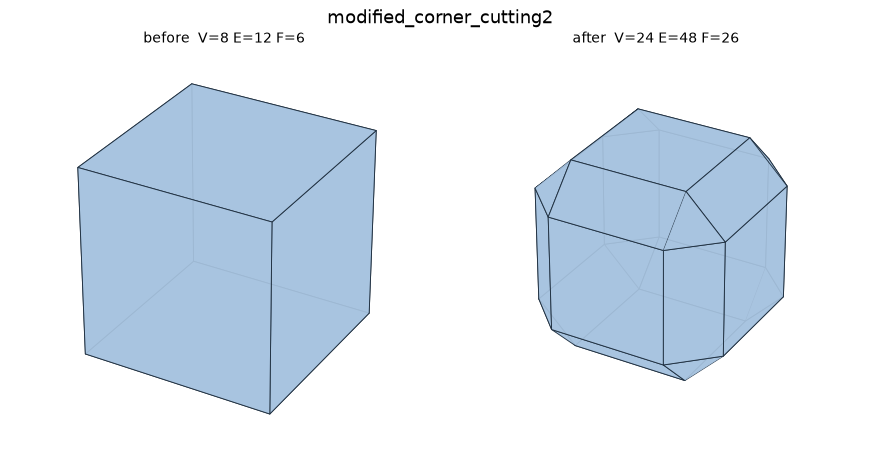

---

## 5. Structural Operators

### #46 create_crust

Turns a surface into a hollow shell: the whole mesh is duplicated with reversed orientation and offset inward along averaged vertex normals, giving an outer and an inner wall. Returns the list of mirrored face pairs (outer face i ↔ inner face F+i); punching holes through pairs with `add_handle` connects the walls and creates tunnels (shown: shell with one hole punched).

- **Signature**: `create_crust(mesh, thickness=0.1) -> (DLFLMesh, pairs)`
- **Token**: `CRUST`
- **Oracle**: V'=2V, E'=2E, F'=2F, 2 components; after punching k holes: genus' = 2g+k−1
- **Parameters**: thickness — shell thickness (negative offsets outward)
- **Differentiable (PyTorch)**: ✅ Yes — dedicated torch implementation: Newell face normals → per-vertex averaged normal (eps-guarded normalization) → inner shell = verts − thickness × normal. Gradients flow to input positions **and** `thickness` (pass as `torch.tensor`). Oracle: matches float path to 1e-9
- **Example primitive**: cube

```python
out, pairs = create_crust(mesh, thickness=0.25)
for outer, inner in pairs[:2]:
    add_handle(out, outer, inner)  # each hole: genus +1
                                   # (first hole joins the walls)
```

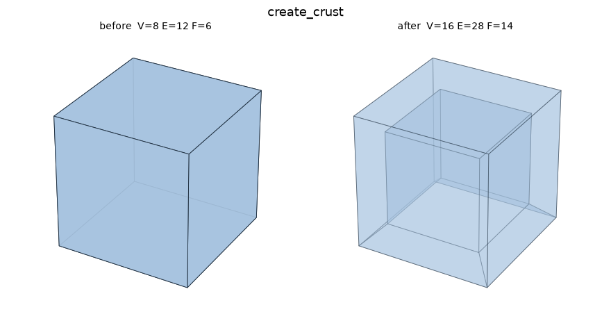

### #47 create_crust_with_scaling

Crust via scaling: instead of normal-offset, the inner shell is produced by scaling all vertices toward the mesh centroid. Same topology as create_crust but different inner geometry. Shown: shell with one hole punched to reveal the inner wall.

- **Signature**: `create_crust_with_scaling(mesh, scale_factor=0.9) -> (DLFLMesh, pairs)`
- **Token**: `—`
- **Oracle**: V'=2V, E'=2E, F'=2F, 2 components
- **Parameters**: scale_factor — inner shell scale toward centroid
- **Differentiable (PyTorch)**: ✅ Yes — dedicated torch implementation: inner shell = verts scaled toward centroid by scale_factor. Gradients flow to input positions and `scale_factor`
- **Example primitive**: cube

```python
out, pairs = create_crust_with_scaling(mesh, scale_factor=0.8)
add_handle(out, pairs[0][0], pairs[0][1])
```

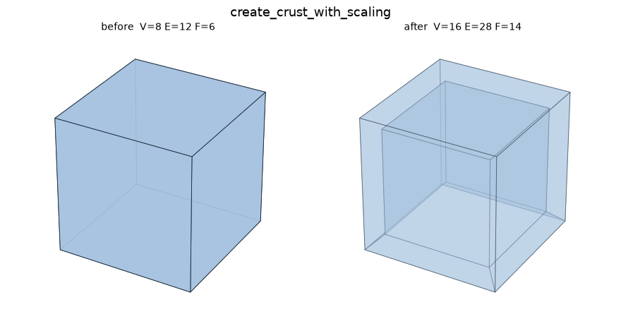

## Tokenizer Usage

```python
from topmod import tokenize, detokenize, build_vocabulary, encode_sequence
from topmod.tokenizer import TopModToken

# Every token sequence executes from the deterministic icosahedron primitive
tokens = [TopModToken(op='PENT'), TopModToken(op='DUAL'), TopModToken(op='EOS')]
mesh = detokenize(tokens)            # guaranteed: is_manifold(mesh) == True

vocab = build_vocabulary()           # token → integer ID (append-only)
ids = encode_sequence(tokens, vocab)
```

Holed shells (a genus construction that generative models can learn):

```python
# After CRUST the mirrored face pairs have deterministic ordinals:
# outer face i ↔ inner face F+i, so hole punching is expressible with the
# existing HDL(face1, face2) token.
tokens = [TopModToken(op='CRUST'),
          TopModToken(op='HDL', refs=(0, 20)),   # icosahedron: F=20
          TopModToken(op='EOS')]
```

## Differentiable Geometry Usage

Operators marked ✅ in the Diff column can be composed into an end-to-end
differentiable map (topology fixed, gradients w.r.t. base-primitive
positions and, for `create_crust`, its `thickness`):

```python
import torch
from topmod.diffgeo import DiffSequence

seq = DiffSequence("cube").append("DS").append("CC")                           .append("CRUST", thickness=0.1)
final_verts = seq.forward()      # differentiable w.r.t. seq.verts0
tris        = seq.triangles()    # for nvdiffrast / pipeline.geometry_optimizer
(final_verts ** 2).sum().backward()
```

Full API and correctness contract: `docs/diffgeo.md`.

## Testing

```bash
python3 -m pytest tests/ -q --ignore=tests/test_manifold_loss.py --ignore=tests/test_pipeline.py
```

Per-operator oracle tests live in `tests/test_semantic_oracle.py` (four
primitives × exact ΔV/ΔE/ΔF/χ/genus + face-degree census); token tests in
`tests/test_tokenizer.py`.

## References

- Akleman & Chen 2003 — the minimal complete DLFL operator set
- `docs/reference_semantics.md` — clean-room extraction (with χ
  verification) of the reference library's semantics (davyrisso/topmod3d, GPL)
- `docs/vocabulary_roadmap.md` — vocabulary evolution roadmap
